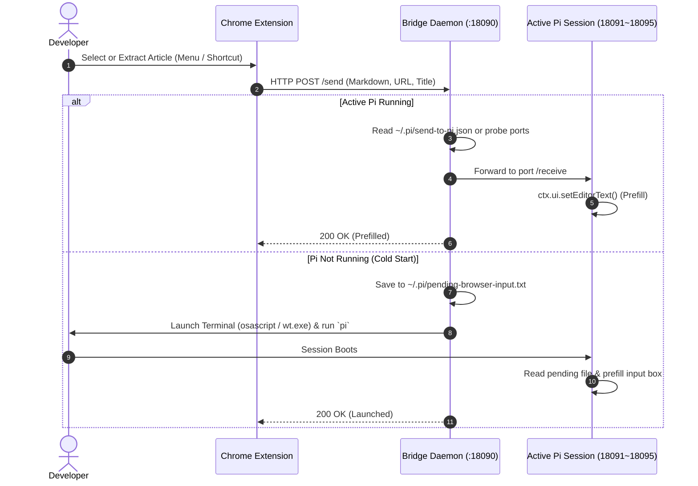

# 🚀 send-to-pi

[**简体中文**](./README_CN.md) | **English**

> Seamlessly bridge your web browser to the [Pi Coding Agent](https://github.com/earendil-works/pi-coding-agent). Send snippets, articles, or links directly into your Pi terminal prompt with one click or keyboard shortcut.

[](https://www.npmjs.com/package/send-to-pi)
[](https://opensource.org/licenses/MIT)
[](https://nodejs.org/)
[]()

---

## 💡 Why send-to-pi?

Modern AI coding agents (like Pi, Claude Code, Aider) shine inside the terminal, but **a massive portion of a developer's daily context lives inside the browser**—GitHub Issues, PR reviews, documentation, Stack Overflow threads, error logs, and technical blog posts.

Traditionally, sending webpage context to an agent means:
1. Selecting text
2. Switching windows
3. Pasting into the terminal
4. Dealing with broken indentation or destroyed tables, then typing instructions manually

**With `send-to-pi`:**
Right-click on any selected text, link, or page ➔ **The text is instantly formatted into Markdown and prefilled into your Pi terminal input box**, with the source title & URL cleanly formatted.
- 🎯 **Prefill Mode (No Auto-Submit)**: The prompt is populated into the editor without auto-submitting. You can review, refine, or append instructions before pressing <kbd>Enter</kbd>.
- 📝 **HTML to Markdown Preservation**: Selection captures `<pre><code>` blocks, language tags, indentation, `<table>` grids, lists, quotes, and links without loss. Falls back gracefully when restricted.
- 📖 **Clean Article Extraction (Readability Mode)**: Extract clean article markdown stripped of navigation, footers, sidebars, and ads. Pi gets immediate full-text context without extra fetching.
- ⌨️ **Keyboard Shortcut**: Instant delivery with <kbd>Alt+Shift+S</kbd> (<kbd>Cmd+Shift+S</kbd> on macOS) right after highlighting text or code.
- 🔄 **Dynamic Port Discovery & Anti-Collision**: Pi sessions automatically probe 18091~18095 and track the most active session in `~/.pi/send-to-pi.json`.
- ⚡ **Cold-Start Auto-Wake**: If Pi isn't running, it automatically opens your terminal, starts Pi, and populates the text once the session boots up.
- 🍏 **True Cross-Platform**: Native terminal launch support for **macOS** (Terminal.app, iTerm2, Ghostty, WezTerm), **Windows** (Windows Terminal, PowerShell), and **Linux**.
- 🔒 **100% Local & Private**: All communication happens via `127.0.0.1`. No cloud proxy, no data logging.

---

## 🛠️ Architecture



---

## 📦 Quick Start (3 Steps)

### Step 1: Install the Pi Extension
You can install it directly via Pi's built-in package manager:

```bash
pi install npm:send-to-pi
```

*(Or from GitHub: `pi install git:github.com/Wude-m/send-to-pi`)*

### Step 2: Start the Bridge Daemon
The bridge daemon runs in the background on your machine:

```bash
# Using npx directly
npx send-to-pi start

# Or clone and run
git clone https://github.com/Wude-m/send-to-pi.git
cd send-to-pi
npm start
```

*(Tip: macOS users can run `bash scripts/start-mac.sh` to run in background. Windows users can double-click `scripts/start-win.vbs` for silent background execution.)*

### Step 3: Load the Chrome Extension
You don't need to hunt for the folder manually! Just run:

```bash
npx send-to-pi extension
```

This will print the exact folder path and **automatically open the extension directory in your file manager**. Then:
1. Open Google Chrome or Microsoft Edge and navigate to `chrome://extensions/`.
2. Toggle on **Developer mode** in the top-right corner.
3. Click **Load unpacked** and select the folder that just opened.
4. You're all set!

---

## ⌨️ How to Use

1. **Send Selected Text / Code (Markdown)**:
   - Highlight text or code ➔ Right-click ➔ Choose `🚀 Send Selection to Pi`;
   - Or press shortcut <kbd>Alt+Shift+S</kbd> (<kbd>Cmd+Shift+S</kbd> on macOS).
2. **Send Clean Article (Readability Mode)**:
   - Right-click anywhere on the webpage ➔ Choose `🚀 Send Clean Article to Pi`.
   - The article body is parsed into clean Markdown without ads or navigation menus.
3. **Send Hyperlink**:
   - Right-click any link ➔ Choose `🚀 Send Link to Pi`.

The formatted context will immediately appear at your terminal cursor:
```text
[Source]: GitHub - earendil-works/pi-coding-agent (https://github.com/...)

```typescript
export default function (pi: ExtensionAPI) { ... }
```
_ [Cursor waits here for your instructions]
```

---

## ⚙️ Configuration & Terminal Customization

You can configure options via environment variables when launching the daemon:

| Environment Variable | Default | Description |
| :--- | :--- | :--- |
| `PI_BRIDGE_PORT` | `18090` | Port listened by the Bridge Daemon |
| `PI_INTERNAL_PORT` | `18091` | Starting port for active Pi sessions (probes 18091~18095) |
| `PI_WORKDIR` | Current directory | Default working directory when auto-launching Pi |
| `PI_TERMINAL` | Auto-detect | Preferred terminal: `iterm2`, `ghostty`, `terminal`, `wezterm`, `alacritty` |

Example on macOS:
```bash
PI_TERMINAL=ghostty PI_WORKDIR=~/mycode npx send-to-pi start
```

---

## 🤝 Contributing

Contributions are warmly welcome! Whether it's:
- Supporting Firefox / Safari extensions
- Adding more terminal emulators
- Providing Homebrew / AUR packages

Please feel free to open an Issue or Pull Request.

---

## 📄 License

MIT License © 2026 Wude
