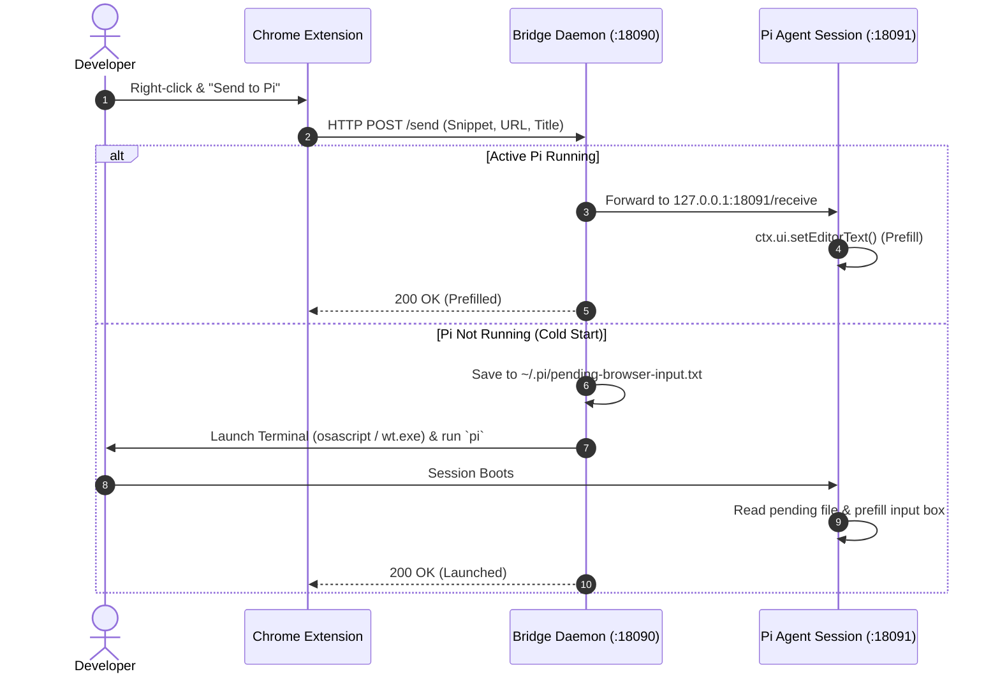

# 🚀 send-to-pi

[**简体中文**](./README_CN.md) | **English**

> Seamlessly bridge your web browser to the [Pi Coding Agent](https://github.com/earendil-works/pi-coding-agent). Send snippets, articles, or links directly into your Pi terminal prompt with one right-click.

[](https://opensource.org/licenses/MIT)
[](https://nodejs.org/)
[]()

---

## 💡 Why send-to-pi?

Modern AI coding agents (like Pi, Claude Code, Aider) shine inside the terminal, but **a massive portion of a developer's daily context lives inside the browser**—GitHub Issues, PR reviews, documentation, Stack Overflow threads, error logs, and technical blog posts.

Traditionally, sending webpage context to an agent means:
1. Selecting text
2. Switching windows
3. Pasting into the terminal
4. Typing instructions

**With `send-to-pi`:**
Right-click on any selected text, link, or page ➔ **The text is instantly prefilled into your Pi terminal input box**, with the source title & URL cleanly formatted.
- 🎯 **Prefill Mode (No Auto-Submit)**: The prompt is populated into the editor without auto-submitting. You can review, refine, or append instructions before pressing <kbd>Enter</kbd>.
- ⚡ **Cold-Start Auto-Wake**: If Pi isn't running, it automatically opens your terminal, starts Pi, and populates the text once the session boots up.
- 🍏 **True Cross-Platform**: Native terminal launch support for **macOS** (Terminal.app, iTerm2, Ghostty, WezTerm), **Windows** (Windows Terminal, PowerShell), and **Linux**.
- 🔒 **100% Local & Private**: All communication happens via `127.0.0.1`. No cloud proxy, no data logging.

---

## 🛠️ Architecture



---

## 📦 Quick Start (3 Steps)

### Step 1: Install the Pi Extension
Copy the extension to your local Pi extensions directory:

**macOS / Linux:**
```bash
mkdir -p ~/.pi/agent/extensions
curl -fsSL https://raw.githubusercontent.com/JIan5090/send-to-pi/main/pi-extension/index.ts -o ~/.pi/agent/extensions/send-to-pi.ts
```

**Windows (PowerShell):**
```powershell
New-Item -ItemType Directory -Force -Path "$env:USERPROFILE\.pi\agent\extensions"
Invoke-WebRequest -Uri "https://raw.githubusercontent.com/JIan5090/send-to-pi/main/pi-extension/index.ts" -OutFile "$env:USERPROFILE\.pi\agent\extensions\send-to-pi.ts"
```

### Step 2: Start the Bridge Daemon
The bridge daemon runs in the background on your machine:

```bash
# Using npx directly
npx send-to-pi start

# Or clone and run
git clone https://github.com/JIan5090/send-to-pi.git
cd send-to-pi
npm start
```

*(Tip: macOS users can run `bash scripts/start-mac.sh` to run in background. Windows users can double-click `scripts/start-win.vbs` for silent background execution.)*

### Step 3: Load the Chrome Extension
1. Open Google Chrome or Microsoft Edge and navigate to `chrome://extensions/`.
2. Toggle on **Developer mode** in the top-right corner.
3. Click **Load unpacked** (加载已解压的扩展程序) and select the `chrome-extension` folder from this repository.
4. You're all set!

---

## ⌨️ How to Use

1. **Send Selected Text**: Highlight code or text on any webpage ➔ Right-click ➔ Choose `🚀 发送选中内容给 Pi`.
2. **Send Whole Page Link & Title**: Right-click anywhere on the page ➔ Choose `🚀 发送当前网页给 Pi`.
3. **Send Hyperlink**: Right-click any link ➔ Choose `🚀 发送此链接给 Pi`.

The formatted context will immediately appear at your terminal cursor:
```text
【来源】：GitHub - earendil-works/pi-coding-agent (https://github.com/...)

Here is the code snippet or issue description...
_ [Cursor waits here for your instructions]
```

---

## ⚙️ Configuration & Terminal Customization

You can configure options via environment variables when launching the daemon:

| Environment Variable | Default | Description |
| :--- | :--- | :--- |
| `PI_BRIDGE_PORT` | `18090` | Port listened by the Bridge Daemon |
| `PI_INTERNAL_PORT` | `18091` | Internal port used by the active Pi session |
| `PI_WORKDIR` | Current directory | Default working directory when auto-launching Pi |
| `PI_TERMINAL` | Auto-detect | Preferred terminal: `iterm2`, `ghostty`, `terminal`, `wezterm`, `alacritty` |

Example on macOS:
```bash
PI_TERMINAL=ghostty PI_WORKDIR=~/mycode npx send-to-pi start
```

---

## 🤝 Contributing

Contributions are warmly welcome! Whether it's:
- Supporting Firefox / Safari extensions
- Adding more terminal emulators
- Providing Homebrew / AUR packages

Please feel free to open an Issue or Pull Request.

---

## 📄 License

MIT License © 2026 JIan (JIan5090)
