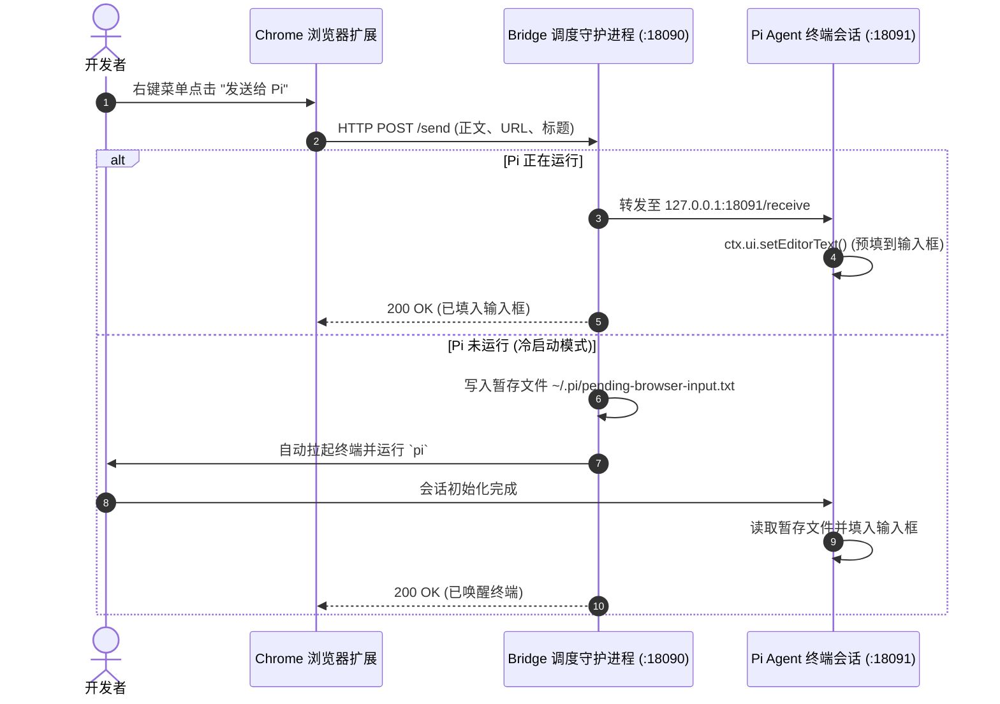

# 🚀 send-to-pi (浏览器网页一键发送至 Pi Agent)

**简体中文** | [**English**](./README.md)

> 让你的网页浏览器与 [Pi 终端编程助手](https://github.com/earendil-works/pi-coding-agent) 无缝打通。在网页上选中文字、链接或页面，一键右键直达终端输入框，自动排版并预填上下文。

[](https://opensource.org/licenses/MIT)
[](https://nodejs.org/)
[]()

---

## 💡 为什么需要 send-to-pi？

现代 AI Coding Agent（如 Pi、Claude Code、Aider 等）在命令行终端里表现极其出色，但日常开发中**绝大部分上下文其实都在浏览器里**——比如正在查阅的 GitHub Issue、PR 代码 Review、官方文档、Stack Overflow 问答、前端报错页面以及技术博文。

以往把网页内容喂给终端 Agent 的流程非常繁琐：
1. 鼠标划词复制
2. Alt+Tab 切到终端窗口
3. 粘贴进输入框
4. 手动打字写“请参考以上网页/报错...”

**有了 `send-to-pi` 之后：**
在任何网页上划选文字、右键链接或页面 ➔ **内容自动携带网页标题与来源 URL，毫秒级预填进 Pi 终端输入框**。
- 🎯 **Prefill 预填模式（绝不自作主张回车）**：内容送到输入框后，光标停留在末尾，你可以从容补充具体指令（如“请根据这段代码重构...”），最后按回车自主发送。
- ⚡ **冷启动自动唤醒终端**：就算你当前没有开着 Pi 终端，右键发送也会自动为你拉起终端、运行 `pi`，并在会话初始化完成后自动填入内容！
- 🍏 **全平台终端适配**：原生支持 **macOS**（Terminal.app、iTerm2、Ghostty、WezTerm 等）、**Windows**（Windows Terminal、PowerShell）以及 **Linux**。
- 🔒 **纯本地与隐私安全**：全链路通过本地环回地址 `127.0.0.1` 传输，无云端中转，零数据收集。

---

## 🛠️ 系统架构与工作流程



---

## 📦 三步快速上手

### 第一步：安装 Pi 原生扩展
将扩展文件复制到你本机的 Pi 扩展目录：

**macOS / Linux:**
```bash
mkdir -p ~/.pi/agent/extensions
curl -fsSL https://raw.githubusercontent.com/Wude-m/send-to-pi/main/pi-extension/index.ts -o ~/.pi/agent/extensions/send-to-pi.ts
```

**Windows (PowerShell):**
```powershell
New-Item -ItemType Directory -Force -Path "$env:USERPROFILE\.pi\agent\extensions"
Invoke-WebRequest -Uri "https://raw.githubusercontent.com/Wude-m/send-to-pi/main/pi-extension/index.ts" -OutFile "$env:USERPROFILE\.pi\agent\extensions\send-to-pi.ts"
```

### 第二步：启动 Bridge 守护进程
调度守护进程负责在后台监听浏览器请求并在需要时唤醒终端：

```bash
# 直接使用 npx 运行
npx send-to-pi start

# 或者克隆本仓库后运行
git clone https://github.com/Wude-m/send-to-pi.git
cd send-to-pi
npm start
```

> **后台常驻小提示**：
> - **macOS / Linux 用户**：直接运行 `bash scripts/start-mac.sh` 即可在后台静默运行。
> - **Windows 用户**：双击 `scripts/start-win.vbs` 即可无黑框后台静默运行。

### 第三步：加载 Chrome 浏览器扩展
1. 打开 Chrome 或 Edge 浏览器，在地址栏输入 `chrome://extensions/`；
2. 开启右上角的 **“开发者模式”**（Developer mode）；
3. 点击左上角的 **“加载已解压的扩展程序”**（Load unpacked）；
4. 选择本仓库的 `chrome-extension` 目录即可！

---

## ⌨️ 日常使用演示

1. **发送划选内容**：网页上鼠标选中任何代码或文本 ➔ 右键 ➔ 点击 `🚀 发送选中内容给 Pi`；
2. **发送整个网页**：在页面空白处 ➔ 右键 ➔ 点击 `🚀 发送当前网页给 Pi`；
3. **发送超链接**：在任意链接上 ➔ 右键 ➔ 点击 `🚀 发送此链接给 Pi`。

终端输入框中会立即呈现带有来源标题与 URL 的整洁内容：
```text
【来源】：GitHub - earendil-works/pi-coding-agent (https://github.com/...)

这里是选中的代码片段或技术文档内容...
_ [光标停在此处，等待你补充提示词]
```

---

## ⚙️ 环境变量与终端自定义

支持通过环境变量调整守护进程行为：

| 环境变量 | 默认值 | 说明 |
| :--- | :--- | :--- |
| `PI_BRIDGE_PORT` | `18090` | Bridge 调度进程监听的端口 |
| `PI_INTERNAL_PORT` | `18091` | 活跃 Pi 会话内部接收端口 |
| `PI_WORKDIR` | 当前目录 | 自动唤醒 Pi 时默认进入的工作目录 |
| `PI_TERMINAL` | 自动探测 | macOS/Linux 指定偏好终端（如 `iterm2`, `ghostty`, `terminal`, `alacritty`） |

macOS 示例：
```bash
PI_TERMINAL=ghostty PI_WORKDIR=~/mycode npx send-to-pi start
```

---

## 🤝 欢迎贡献

欢迎提交 PR 或 Issue！无论是：
- 适配 Firefox / Safari 扩展
- 支持更多小众终端仿真器
- 完善打包与系统服务脚本

---

## 📄 开源协议

基于 [MIT License](./LICENSE) 开源 © 2026 Wude
